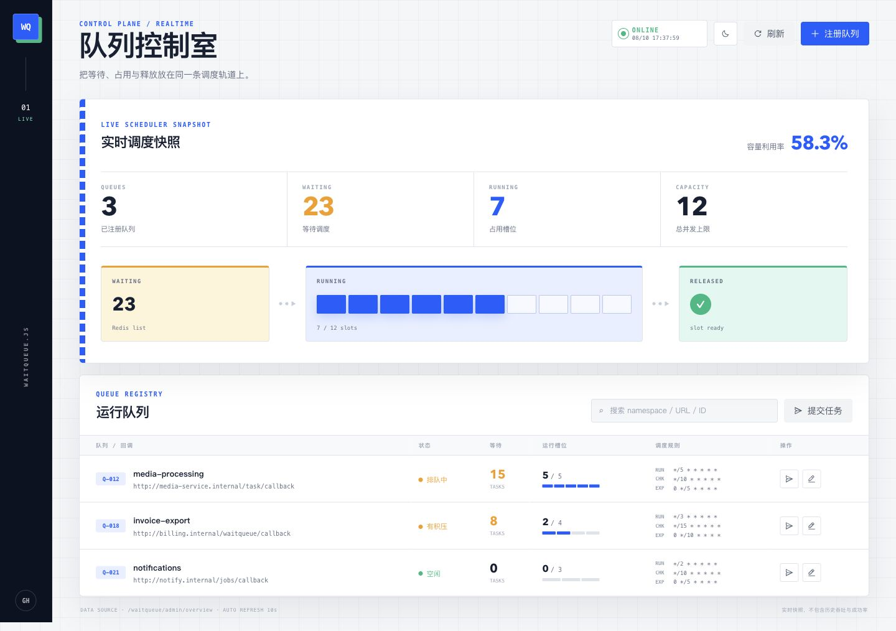

# WaitQueue Control Room

waitqueue.js 的轻量实时运维控制台。它直接读取后端队列配置与 Redis 实时计数，不使用 mock 数据，也不展示当前系统无法证明的历史指标。



## 页面能力

- 汇总队列数、waiting、running、capacity 和实时利用率；
- 用 Waiting → Running → Released 轨道表达调度状态；
- 展示各队列回调、并发占用和 run/check/expire cron；
- 搜索队列，注册或更新队列，提交 taskId；
- 每 10 秒自动刷新，页面切到后台时暂停；
- 支持浅色/深色主题、桌面与移动布局；
- 处理 loading、empty、stale 和 offline 状态。

当前没有任务历史存储，因此页面不会展示吞吐趋势、成功率、平均耗时或任务明细。

## 本地开发

前置条件：

- Node.js `>= 20.9`；
- Corepack / pnpm 8；
- 已在 `http://127.0.0.1:3000` 启动 wait-queue 后端。

从仓库根目录执行：

```bash
corepack enable
corepack pnpm --dir admin-dashboard install --frozen-lockfile
cp admin-dashboard/.env.example admin-dashboard/.env.local
corepack pnpm --dir admin-dashboard dev
```

访问 [http://127.0.0.1:3001](http://127.0.0.1:3001)。

如果后端不在默认地址，修改 `admin-dashboard/.env.local`：

```dotenv
WAITQUEUE_API_URL=http://127.0.0.1:3000
```

## 生产构建

```bash
corepack pnpm --dir admin-dashboard typecheck
corepack pnpm --dir admin-dashboard build
corepack pnpm --dir admin-dashboard start
```

`dev` 和 `start` 都固定监听 3001，避免与后端默认的 3000 冲突。构建和启动时应提供同一个 `WAITQUEUE_API_URL`。

## 数据链路

```text
Browser
  └─ /waitqueue/*（同源）
       └─ Next.js rewrite
            └─ WAITQUEUE_API_URL
                 ├─ GET  /waitqueue/admin/overview
                 ├─ POST /waitqueue/queue/newQueue
                 └─ POST /waitqueue/scheduler/addTask
```

`WAITQUEUE_API_URL` 只由 Next.js 服务端读取，不会进入浏览器 bundle。后端无需开启 CORS。

## 技术与目录

运行时只保留四个直接依赖：Next.js、React、React DOM 和 Arco Design。

```text
admin-dashboard/
├── src/pages/_app.tsx             # 全局样式与页面入口
├── src/pages/index.tsx            # 数据读取、交互与控制室页面
├── src/style/global.css           # 设计 token、主题与基础样式
├── src/style/dashboard.module.css # 页面布局、轨道和响应式样式
├── next.config.js                 # API 同源代理
└── .env.example                   # 后端地址示例
```

HTTP 使用浏览器原生 `fetch`，页面状态使用 React hooks；没有 Redux、Axios、Mock.js 或图表运行时。

## 安全边界

控制台没有独立登录页，后端 API 也尚未内置鉴权。部署时必须：

- 将控制台和 API 放到可信网络或认证网关之后；
- 对写接口增加认证、授权和审计；
- 限制可注册的 `hookUrl` 主机与网段，防止 SSRF；
- 不把管理端直接暴露到公网。

完整启动流程、API 和回调协议见仓库根目录 [README.md](../README.md)。
